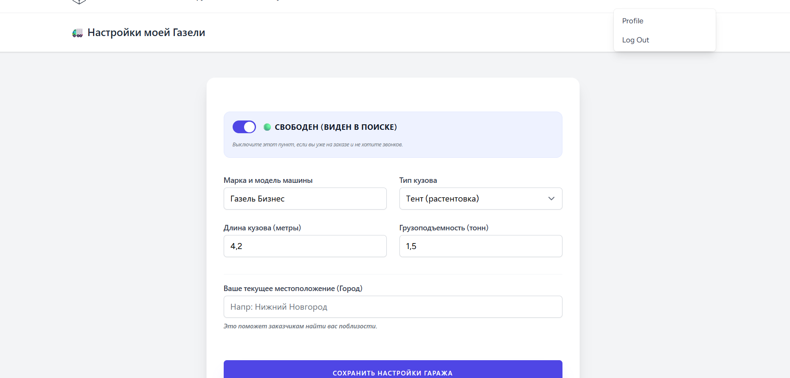
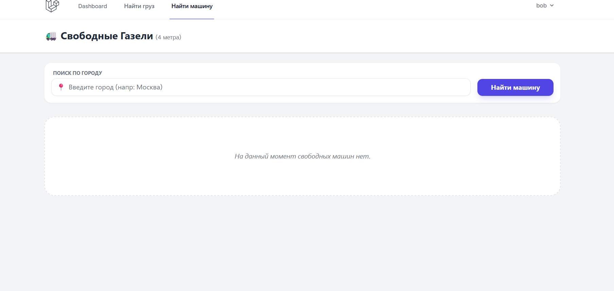
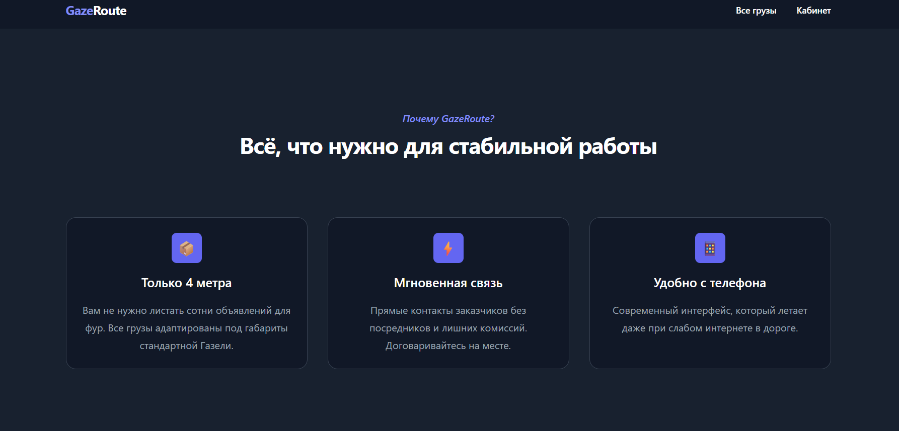

# 🚚 GazeRoute — Нишевый логистический сервис (SaaS MVP)
 
 
 

**GazeRoute** — это Fullstack-платформа для агрегации попутных грузов и управления парком малотоннажного транспорта (Газель 4м). Проект спроектирован с упором на скорость работы "в полях" и строгую валидацию логистических параметров.

---

## 🛠 Технологический стек (Tech Stack)
- **Engine:** PHP 8.2+ / Laravel 11 (MVC Architecture)
- **Frontend:** **TALL Stack Lite** (Tailwind CSS 3.4, Alpine.js, Blade)
- **Auth:** Laravel Breeze (Session-based)
- **Database:** MySQL 8.0 (Eloquent ORM)
- **DevOps:** Docker (Laravel Sail), Vite, Git

---

## 🏗 Ключевые технические особенности

### 1. Проектирование БД и Логика (Data Integrity)
- **Relational Mapping:** Реализована структура связей `User -> Vehicle (1:1)` и `User -> Cargo (1:N)` с каскадным удалением зависимых данных.
- **Smart Validation:** Внедрена серверная валидация физических ограничений (грузоподъемность до 2т, объем до 20м³), предотвращающая ввод некорректных логистических данных.
- **Query Builder:** Система фильтрации реализована через гибкие запросы к БД с сохранением состояния фильтров в URL (Query String), что позволяет пользователям обмениваться ссылками на конкретные маршруты.

### 2. Оптимизация под мобильные устройства (Mobile First)
- **Driver-Centric UI:** Интерфейс спроектирован с учетом использования "на ходу": крупные тач-зоны, минимизация текстового ввода, контрастная **Dark Theme** для ночных рейсов.
- **Reactive States:** Использование **Alpine.js** для мгновенного переключения статусов ("Свободен/Занят") без перезагрузки страницы, что снижает нагрузку на сервер и улучшает UX.

### 3. Безопасность и SEO
- **RBAC:** Ролевая модель доступа (Гость / Авторизованный пользователь / Владелец контента).
- **Security:** Полная защита от SQL-инъекций (через Eloquent), CSRF и XSS атак.
- **Friendly URLs:** Чистые маршруты для лучшей индексации объявлений поисковыми системами.

---

## 🚀 Развертывание (Installation)

Проект полностью контейнеризирован через **Laravel Sail**:

```bash
# 1. Клонирование и переход в директорию
git clone https://github.com/Laracoper/GazeRoute.git && cd GazeRoute

# 2. Установка зависимостей (PHP & JS)
docker run --rm -v $(pwd):/var/www/html -w /var/www/html laravelsail/php82-composer:latest composer install
npm install

# 3. Запуск инфраструктуры (App, MySQL)
./vendor/bin/sail up -d

# 4. Миграции и наполнение тестовыми данными
./vendor/bin/sail artisan migrate --seed

# 5. Сборка фронтенда
./vendor/bin/sail npm run dev
